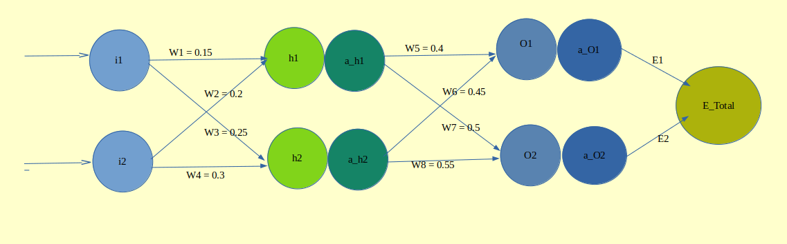
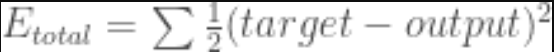
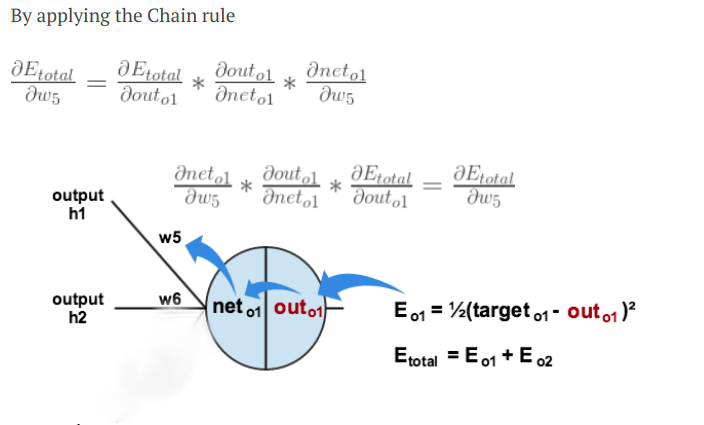
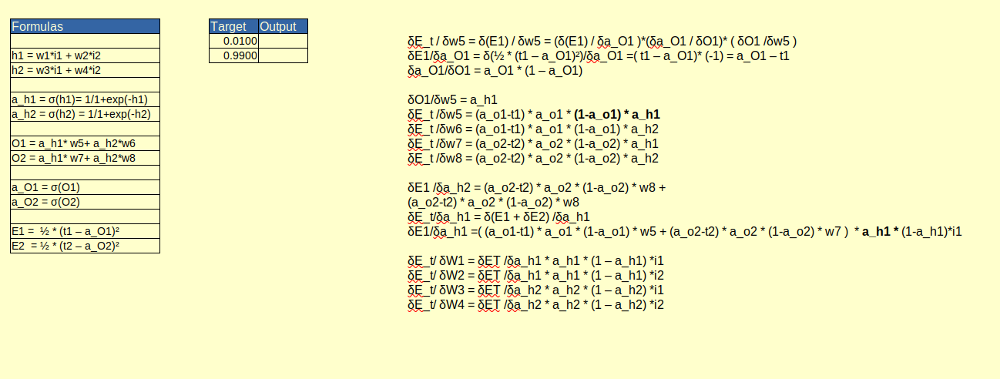
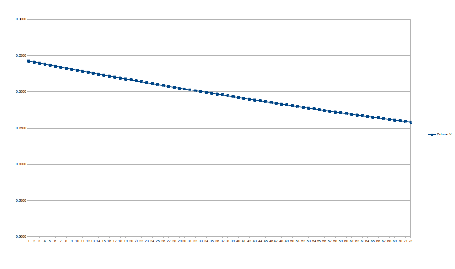

# A Step by Step Back propagation Example

## Background

Back propagation is a common method for training a neural network.  This is a  attempt to explain how it works with a concrete example .

## Overview

For this we are going to use a neural network with two inputs, two hidden neurons, two output neurons.

Here’s the basic structure:

The goal of back propagation is to optimise the weights so that the neural network can learn how to correctly map arbitrary inputs to outputs.

Here we are working with training set: given inputs 0.05 and 0.10, we want the neural network to output 0.01 and 0.99.

## The Forward Pass

To begin with  lets see what the neural network currently predicts given the weights and biases above and inputs of 0.05 and 0.10. To do this we’ll feed those inputs forward though the network.

We figure out the *total net input* to each hidden layer neuron, *squash* the total net input using an *activation function*  then repeat the process with the output layer neurons.

Here’s how we calculate the total net input for h1:

*Net h1 = W1 * i1 + W2 * i2*

We then squash it using the logistic function to get the output of h1:

a_h1 = 1/(1+e^-net h1)

Carrying out the same process for h2 we get:

*Net h2 = W3 * i1 + W4 * i2*

We repeat this process for the output layer neurons, using the output from the hidden layer neurons as inputs.

### Calculating the Total Error

We can now calculate the error for each output neuron using the squared error function and sum them to get the total error:

The 1/2 is included so that exponent is cancelled when we differentiate later on.

## The Backwards Pass

Our goal with back propagation is to update each of the weights in the network so that they cause the actual output to be closer the target output, thereby minimizing the error for each output neuron and the network as a whole.

### Output Layer

Consider w5 . We want to know how much a change in w5 affects the total error.

i.e = dE_total/dw5

**The Excel work for the calculation**

 

The Output of the Excel 2

learning rate : 2

| **t1** | **t2** | **i1** | **i2** | **W1** | **W2** | **W3** | **W4** | **h1** | **a_h1** | **h2** | **a_h2** | **W5**  | **W6**  | **W7** | **W8** | **O1**  | **a_O1** | **O2** | **a_O2** | **E1** | **E2** | **E_Total** | **EδW1** | **EδW2** | **EδW3** | **EδW4** | **EδW5** | **EδW6** | **EδW7** | **EδW8** |
| ------ | ------ | ------ | ------ | ------ | ------ | ------ | ------ | ------ | -------- | ------ | -------- | ------- | ------- | ------ | ------ | ------- | -------- | ------ | -------- | ------ | ------ | ----------- | -------- | -------- | -------- | -------- | -------- | -------- | -------- | -------- |
| 0.0100 | 0.9900 | 0.0500 | 0.1000 | 0.1500 | 0.2000 | 0.2500 | 0.3000 | 0.0275 | 0.5069   | 0.0425 | 0.5106   | 0.4000  | 0.4500  | 0.5000 | 0.5500 | 0.4325  | 0.6065   | 0.5343 | 0.6305   | 0.1779 | 0.0646 | 0.2425      | 0.0002   | 0.0004   | 0.0002   | 0.0004   | 0.0722   | 0.0727   | -0.0425  | -0.0428  |
| 0.0100 | 0.9900 | 0.0500 | 0.1000 | 0.1496 | 0.1992 | 0.2496 | 0.2991 | 0.0274 | 0.5069   | 0.0424 | 0.5106   | 0.2557  | 0.3046  | 0.5849 | 0.6355 | 0.2851  | 0.5708   | 0.6210 | 0.6504   | 0.1573 | 0.0577 | 0.2149      | -0.0001  | -0.0003  | -0.0001  | -0.0002  | 0.0696   | 0.0702   | -0.0391  | -0.0394  |
| 0.0100 | 0.9900 | 0.0500 | 0.1000 | 0.1499 | 0.1997 | 0.2497 | 0.2995 | 0.0275 | 0.5069   | 0.0424 | 0.5106   | 0.1164  | 0.1643  | 0.6632 | 0.7144 | 0.1429  | 0.5357   | 0.7009 | 0.6684   | 0.1382 | 0.0517 | 0.1899      | -0.0004  | -0.0008  | -0.0004  | -0.0007  | 0.0663   | 0.0668   | -0.0361  | -0.0364  |
| 0.0100 | 0.9900 | 0.0500 | 0.1000 | 0.1507 | 0.2014 | 0.2505 | 0.3009 | 0.0277 | 0.5069   | 0.0426 | 0.5107   | -0.0161 | 0.0308  | 0.7354 | 0.7872 | 0.0075  | 0.5019   | 0.7748 | 0.6846   | 0.1210 | 0.0466 | 0.1676      | -0.0006  | -0.0013  | -0.0006  | -0.0012  | 0.0623   | 0.0628   | -0.0334  | -0.0337  |
| 0.0100 | 0.9900 | 0.0500 | 0.1000 | 0.1519 | 0.2039 | 0.2517 | 0.3033 | 0.0280 | 0.5070   | 0.0429 | 0.5107   | -0.1408 | -0.0948 | 0.8023 | 0.8545 | -0.1198 | 0.4701   | 0.8432 | 0.6991   | 0.1058 | 0.0423 | 0.1481      | -0.0008  | -0.0016  | -0.0008  | -0.0016  | 0.0581   | 0.0585   | -0.0310  | -0.0312  |
| 0.0100 | 0.9900 | 0.0500 | 0.1000 | 0.1536 | 0.2071 | 0.2532 | 0.3065 | 0.0284 | 0.5071   | 0.0433 | 0.5108   | -0.2570 | -0.2119 | 0.8643 | 0.9170 | -0.2386 | 0.4406   | 0.9068 | 0.7123   | 0.0927 | 0.0385 | 0.1313      | -0.0010  | -0.0019  | -0.0009  | -0.0019  | 0.0538   | 0.0542   | -0.0289  | -0.0291  |
| 0.0100 | 0.9900 | 0.0500 | 0.1000 | 0.1555 | 0.2110 | 0.2551 | 0.3102 | 0.0289 | 0.5072   | 0.0438 | 0.5109   | -0.3647 | -0.3203 | 0.9220 | 0.9752 | -0.3486 | 0.4137   | 0.9659 | 0.7243   | 0.0815 | 0.0353 | 0.1168      | -0.0011  | -0.0021  | -0.0010  | -0.0021  | 0.0497   | 0.0500   | -0.0269  | -0.0271  |
| 0.0100 | 0.9900 | 0.0500 | 0.1000 | 0.1576 | 0.2152 | 0.2572 | 0.3144 | 0.0294 | 0.5073   | 0.0443 | 0.5111   | -0.4640 | -0.4204 | 0.9759 | 1.0294 | -0.4503 | 0.3893   | 1.0212 | 0.7352   | 0.0719 | 0.0325 | 0.1044      | -0.0011  | -0.0023  | -0.0011  | -0.0022  | 0.0458   | 0.0461   | -0.0252  | -0.0254  |
| 0.0100 | 0.9900 | 0.0500 | 0.1000 | 0.1598 | 0.2197 | 0.2594 | 0.3188 | 0.0300 | 0.5075   | 0.0449 | 0.5112   | -0.5555 | -0.5125 | 1.0262 | 1.0801 | -0.5439 | 0.3673   | 1.0729 | 0.7452   | 0.0638 | 0.0300 | 0.0938      | -0.0012  | -0.0023  | -0.0012  | -0.0023  | 0.0421   | 0.0424   | -0.0236  | -0.0238  |
| 0.0100 | 0.9900 | 0.0500 | 0.1000 | 0.1622 | 0.2244 | 0.2617 | 0.3235 | 0.0305 | 0.5076   | 0.0454 | 0.5114   | -0.6398 | -0.5974 | 1.0734 | 1.1276 | -0.6303 | 0.3474   | 1.1215 | 0.7543   | 0.0569 | 0.0278 | 0.0847      | -0.0012  | -0.0024  | -0.0012  | -0.0024  | 0.0388   | 0.0391   | -0.0222  | -0.0223  |
| 0.0100 | 0.9900 | 0.0500 | 0.1000 | 0.1646 | 0.2292 | 0.2641 | 0.3282 | 0.0311 | 0.5078   | 0.0460 | 0.5115   | -0.7174 | -0.6757 | 1.1178 | 1.1723 | -0.7099 | 0.3296   | 1.1672 | 0.7626   | 0.0511 | 0.0258 | 0.0769      | -0.0012  | -0.0024  | -0.0012  | -0.0024  | 0.0359   | 0.0361   | -0.0209  | -0.0211  |
| 0.0100 | 0.9900 | 0.0500 | 0.1000 | 0.1670 | 0.2340 | 0.2665 | 0.3330 | 0.0318 | 0.5079   | 0.0466 | 0.5117   | -0.7892 | -0.7479 | 1.1596 | 1.2144 | -0.7835 | 0.3136   | 1.2103 | 0.7704   | 0.0461 | 0.0241 | 0.0702      | -0.0012  | -0.0024  | -0.0012  | -0.0024  | 0.0332   | 0.0334   | -0.0197  | -0.0199  |
| 0.0100 | 0.9900 | 0.0500 | 0.1000 | 0.1694 | 0.2388 | 0.2689 | 0.3378 | 0.0324 | 0.5081   | 0.0472 | 0.5118   | -0.8556 | -0.8148 | 1.1990 | 1.2542 | -0.8517 | 0.2991   | 1.2511 | 0.7775   | 0.0418 | 0.0226 | 0.0644      | -0.0012  | -0.0024  | -0.0012  | -0.0024  | 0.0308   | 0.0310   | -0.0187  | -0.0188  |
| 0.0100 | 0.9900 | 0.0500 | 0.1000 | 0.1718 | 0.2436 | 0.2713 | 0.3426 | 0.0330 | 0.5082   | 0.0478 | 0.5120   | -0.9171 | -0.8768 | 1.2364 | 1.2918 | -0.9150 | 0.2860   | 1.2897 | 0.7841   | 0.0381 | 0.0212 | 0.0593      | -0.0012  | -0.0024  | -0.0012  | -0.0024  | 0.0286   | 0.0288   | -0.0177  | -0.0178  |
| 0.0100 | 0.9900 | 0.0500 | 0.1000 | 0.1742 | 0.2484 | 0.2737 | 0.3473 | 0.0335 | 0.5084   | 0.0484 | 0.5121   | -0.9744 | -0.9345 | 1.2718 | 1.3275 | -0.9739 | 0.2741   | 1.3264 | 0.7902   | 0.0349 | 0.0200 | 0.0548      | -0.0012  | -0.0023  | -0.0012  | -0.0023  | 0.0267   | 0.0269   | -0.0168  | -0.0170  |
| 0.0100 | 0.9900 | 0.0500 | 0.1000 | 0.1765 | 0.2530 | 0.2760 | 0.3520 | 0.0341 | 0.5085   | 0.0490 | 0.5122   | -1.0278 | -0.9883 | 1.3055 | 1.3614 | -1.0290 | 0.2633   | 1.3613 | 0.7960   | 0.0321 | 0.0188 | 0.0509      | -0.0011  | -0.0023  | -0.0011  | -0.0023  | 0.0250   | 0.0252   | -0.0160  | -0.0161  |
| 0.0100 | 0.9900 | 0.0500 | 0.1000 | 0.1788 | 0.2576 | 0.2783 | 0.3565 | 0.0347 | 0.5087   | 0.0496 | 0.5124   | -1.0778 | -1.0387 | 1.3375 | 1.3937 | -1.0805 | 0.2534   | 1.3945 | 0.8013   | 0.0296 | 0.0178 | 0.0474      | -0.0011  | -0.0022  | -0.0011  | -0.0022  | 0.0234   | 0.0236   | -0.0153  | -0.0154  |
| 0.0100 | 0.9900 | 0.0500 | 0.1000 | 0.1811 | 0.2621 | 0.2805 | 0.3610 | 0.0353 | 0.5088   | 0.0501 | 0.5125   | -1.1247 | -1.0859 | 1.3681 | 1.4245 | -1.1288 | 0.2444   | 1.4262 | 0.8063   | 0.0275 | 0.0169 | 0.0443      | -0.0011  | -0.0022  | -0.0011  | -0.0022  | 0.0220   | 0.0222   | -0.0146  | -0.0147  |
| 0.0100 | 0.9900 | 0.0500 | 0.1000 | 0.1833 | 0.2665 | 0.2827 | 0.3654 | 0.0358 | 0.5090   | 0.0507 | 0.5127   | -1.1687 | -1.1302 | 1.3973 | 1.4539 | -1.1742 | 0.2361   | 1.4565 | 0.8110   | 0.0256 | 0.0160 | 0.0416      | -0.0011  | -0.0021  | -0.0011  | -0.0021  | 0.0208   | 0.0209   | -0.0140  | -0.0141  |
| 0.0100 | 0.9900 | 0.0500 | 0.1000 | 0.1854 | 0.2708 | 0.2849 | 0.3697 | 0.0364 | 0.5091   | 0.0512 | 0.5128   | -1.2102 | -1.1720 | 1.4252 | 1.4820 | -1.2171 | 0.2284   | 1.4855 | 0.8154   | 0.0239 | 0.0152 | 0.0391      | -0.0011  | -0.0021  | -0.0011  | -0.0021  | 0.0196   | 0.0197   | -0.0134  | -0.0135  |
| 0.0100 | 0.9900 | 0.0500 | 0.1000 | 0.1875 | 0.2750 | 0.2870 | 0.3739 | 0.0369 | 0.5092   | 0.0517 | 0.5129   | -1.2494 | -1.2115 | 1.4520 | 1.5090 | -1.2577 | 0.2214   | 1.5134 | 0.8196   | 0.0223 | 0.0145 | 0.0369      | -0.0010  | -0.0021  | -0.0010  | -0.0021  | 0.0186   | 0.0187   | -0.0128  | -0.0129  |
| 0.0100 | 0.9900 | 0.0500 | 0.1000 | 0.1896 | 0.2791 | 0.2890 | 0.3780 | 0.0374 | 0.5093   | 0.0523 | 0.5131   | -1.2865 | -1.2489 | 1.4776 | 1.5348 | -1.2960 | 0.2148   | 1.5401 | 0.8235   | 0.0210 | 0.0139 | 0.0348      | -0.0010  | -0.0020  | -0.0010  | -0.0020  | 0.0176   | 0.0177   | -0.0123  | -0.0124  |
| 0.0100 | 0.9900 | 0.0500 | 0.1000 | 0.1916 | 0.2831 | 0.2910 | 0.3820 | 0.0379 | 0.5095   | 0.0528 | 0.5132   | -1.3217 | -1.2844 | 1.5023 | 1.5597 | -1.3325 | 0.2087   | 1.5658 | 0.8272   | 0.0198 | 0.0133 | 0.0330      | -0.0010  | -0.0020  | -0.0010  | -0.0020  | 0.0167   | 0.0168   | -0.0119  | -0.0119  |
| 0.0100 | 0.9900 | 0.0500 | 0.1000 | 0.1935 | 0.2870 | 0.2930 | 0.3859 | 0.0384 | 0.5096   | 0.0532 | 0.5133   | -1.3552 | -1.3181 | 1.5260 | 1.5836 | -1.3671 | 0.2031   | 1.5905 | 0.8307   | 0.0186 | 0.0127 | 0.0313      | -0.0010  | -0.0019  | -0.0010  | -0.0019  | 0.0159   | 0.0160   | -0.0114  | -0.0115  |
| 0.0100 | 0.9900 | 0.0500 | 0.1000 | 0.1954 | 0.2909 | 0.2949 | 0.3898 | 0.0389 | 0.5097   | 0.0537 | 0.5134   | -1.3870 | -1.3501 | 1.5489 | 1.6066 | -1.4002 | 0.1978   | 1.6143 | 0.8340   | 0.0176 | 0.0122 | 0.0298      | -0.0009  | -0.0019  | -0.0009  | -0.0019  | 0.0152   | 0.0153   | -0.0110  | -0.0111  |
| 0.0100 | 0.9900 | 0.0500 | 0.1000 | 0.1973 | 0.2946 | 0.2968 | 0.3935 | 0.0393 | 0.5098   | 0.0542 | 0.5135   | -1.4174 | -1.3807 | 1.5709 | 1.6287 | -1.4317 | 0.1928   | 1.6373 | 0.8372   | 0.0167 | 0.0117 | 0.0284      | -0.0009  | -0.0018  | -0.0009  | -0.0018  | 0.0145   | 0.0146   | -0.0106  | -0.0107  |
| 0.0100 | 0.9900 | 0.0500 | 0.1000 | 0.1991 | 0.2983 | 0.2986 | 0.3972 | 0.0398 | 0.5099   | 0.0546 | 0.5137   | -1.4464 | -1.4100 | 1.5921 | 1.6501 | -1.4618 | 0.1882   | 1.6595 | 0.8402   | 0.0159 | 0.0112 | 0.0271      | -0.0009  | -0.0018  | -0.0009  | -0.0018  | 0.0139   | 0.0140   | -0.0103  | -0.0103  |
| 0.0100 | 0.9900 | 0.0500 | 0.1000 | 0.2009 | 0.3018 | 0.3004 | 0.4008 | 0.0402 | 0.5101   | 0.0551 | 0.5138   | -1.4742 | -1.4379 | 1.6126 | 1.6708 | -1.4907 | 0.1838   | 1.6809 | 0.8430   | 0.0151 | 0.0108 | 0.0259      | -0.0009  | -0.0017  | -0.0009  | -0.0017  | 0.0133   | 0.0134   | -0.0099  | -0.0100  |
| 0.0100 | 0.9900 | 0.0500 | 0.1000 | 0.2027 | 0.3053 | 0.3021 | 0.4043 | 0.0407 | 0.5102   | 0.0555 | 0.5139   | -1.5008 | -1.4647 | 1.6325 | 1.6908 | -1.5183 | 0.1797   | 1.7017 | 0.8458   | 0.0144 | 0.0104 | 0.0248      | -0.0009  | -0.0017  | -0.0009  | -0.0017  | 0.0128   | 0.0129   | -0.0096  | -0.0097  |
| 0.0100 | 0.9900 | 0.0500 | 0.1000 | 0.2044 | 0.3087 | 0.3038 | 0.4077 | 0.0411 | 0.5103   | 0.0560 | 0.5140   | -1.5263 | -1.4904 | 1.6517 | 1.7101 | -1.5449 | 0.1758   | 1.7218 | 0.8484   | 0.0137 | 0.0100 | 0.0238      | -0.0008  | -0.0017  | -0.0008  | -0.0017  | 0.0123   | 0.0124   | -0.0093  | -0.0094  |
| 0.0100 | 0.9900 | 0.0500 | 0.1000 | 0.2060 | 0.3121 | 0.3055 | 0.4110 | 0.0415 | 0.5104   | 0.0564 | 0.5141   | -1.5508 | -1.5151 | 1.6703 | 1.7289 | -1.5704 | 0.1722   | 1.7413 | 0.8508   | 0.0131 | 0.0097 | 0.0228      | -0.0008  | -0.0016  | -0.0008  | -0.0016  | 0.0118   | 0.0119   | -0.0090  | -0.0091  |
| 0.0100 | 0.9900 | 0.0500 | 0.1000 | 0.2077 | 0.3153 | 0.3072 | 0.4143 | 0.0419 | 0.5105   | 0.0568 | 0.5142   | -1.5744 | -1.5389 | 1.6883 | 1.7470 | -1.5950 | 0.1687   | 1.7601 | 0.8532   | 0.0126 | 0.0094 | 0.0219      | -0.0008  | -0.0016  | -0.0008  | -0.0016  | 0.0114   | 0.0114   | -0.0087  | -0.0088  |
| 0.0100 | 0.9900 | 0.0500 | 0.1000 | 0.2093 | 0.3185 | 0.3088 | 0.4175 | 0.0423 | 0.5106   | 0.0572 | 0.5143   | -1.5971 | -1.5618 | 1.7058 | 1.7646 | -1.6187 | 0.1654   | 1.7785 | 0.8555   | 0.0121 | 0.0090 | 0.0211      | -0.0008  | -0.0016  | -0.0008  | -0.0016  | 0.0110   | 0.0110   | -0.0085  | -0.0086  |
| 0.0100 | 0.9900 | 0.0500 | 0.1000 | 0.2108 | 0.3216 | 0.3103 | 0.4207 | 0.0427 | 0.5107   | 0.0576 | 0.5144   | -1.6190 | -1.5838 | 1.7228 | 1.7817 | -1.6415 | 0.1623   | 1.7963 | 0.8577   | 0.0116 | 0.0088 | 0.0203      | -0.0008  | -0.0015  | -0.0008  | -0.0015  | 0.0106   | 0.0106   | -0.0082  | -0.0083  |
| 0.0100 | 0.9900 | 0.0500 | 0.1000 | 0.2124 | 0.3247 | 0.3119 | 0.4237 | 0.0431 | 0.5108   | 0.0580 | 0.5145   | -1.6402 | -1.6051 | 1.7393 | 1.7983 | -1.6636 | 0.1593   | 1.8136 | 0.8598   | 0.0111 | 0.0085 | 0.0196      | -0.0008  | -0.0015  | -0.0008  | -0.0015  | 0.0102   | 0.0103   | -0.0080  | -0.0081  |
| 0.0100 | 0.9900 | 0.0500 | 0.1000 | 0.2139 | 0.3277 | 0.3134 | 0.4267 | 0.0435 | 0.5109   | 0.0583 | 0.5146   | -1.6606 | -1.6257 | 1.7553 | 1.8145 | -1.6849 | 0.1564   | 1.8304 | 0.8618   | 0.0107 | 0.0082 | 0.0189      | -0.0007  | -0.0015  | -0.0007  | -0.0015  | 0.0099   | 0.0099   | -0.0078  | -0.0079  |
| 0.0100 | 0.9900 | 0.0500 | 0.1000 | 0.2153 | 0.3307 | 0.3148 | 0.4297 | 0.0438 | 0.5110   | 0.0587 | 0.5147   | -1.6803 | -1.6456 | 1.7709 | 1.8302 | -1.7055 | 0.1537   | 1.8468 | 0.8638   | 0.0103 | 0.0080 | 0.0183      | -0.0007  | -0.0014  | -0.0007  | -0.0014  | 0.0096   | 0.0096   | -0.0076  | -0.0076  |
| 0.0100 | 0.9900 | 0.0500 | 0.1000 | 0.2168 | 0.3335 | 0.3163 | 0.4326 | 0.0442 | 0.5110   | 0.0591 | 0.5148   | -1.6995 | -1.6648 | 1.7861 | 1.8455 | -1.7255 | 0.1512   | 1.8628 | 0.8656   | 0.0100 | 0.0077 | 0.0177      | -0.0007  | -0.0014  | -0.0007  | -0.0014  | 0.0093   | 0.0093   | -0.0074  | -0.0074  |
| 0.0100 | 0.9900 | 0.0500 | 0.1000 | 0.2182 | 0.3364 | 0.3177 | 0.4354 | 0.0445 | 0.5111   | 0.0594 | 0.5149   | -1.7180 | -1.6835 | 1.8009 | 1.8604 | -1.7449 | 0.1487   | 1.8783 | 0.8674   | 0.0096 | 0.0075 | 0.0171      | -0.0007  | -0.0014  | -0.0007  | -0.0014  | 0.0090   | 0.0090   | -0.0072  | -0.0073  |
| 0.0100 | 0.9900 | 0.0500 | 0.1000 | 0.2196 | 0.3392 | 0.3191 | 0.4382 | 0.0449 | 0.5112   | 0.0598 | 0.5149   | -1.7359 | -1.7016 | 1.8153 | 1.8749 | -1.7636 | 0.1463   | 1.8935 | 0.8692   | 0.0093 | 0.0073 | 0.0166      | -0.0007  | -0.0014  | -0.0007  | -0.0014  | 0.0087   | 0.0088   | -0.0070  | -0.0071  |
| 0.0100 | 0.9900 | 0.0500 | 0.1000 | 0.2209 | 0.3419 | 0.3205 | 0.4410 | 0.0452 | 0.5113   | 0.0601 | 0.5150   | -1.7533 | -1.7191 | 1.8293 | 1.8891 | -1.7819 | 0.1441   | 1.9083 | 0.8708   | 0.0090 | 0.0071 | 0.0161      | -0.0007  | -0.0013  | -0.0007  | -0.0013  | 0.0085   | 0.0085   | -0.0069  | -0.0069  |
| 0.0100 | 0.9900 | 0.0500 | 0.1000 | 0.2223 | 0.3445 | 0.3218 | 0.4436 | 0.0456 | 0.5114   | 0.0605 | 0.5151   | -1.7702 | -1.7361 | 1.8430 | 1.9029 | -1.7996 | 0.1419   | 1.9227 | 0.8724   | 0.0087 | 0.0069 | 0.0156      | -0.0007  | -0.0013  | -0.0007  | -0.0013  | 0.0082   | 0.0083   | -0.0067  | -0.0067  |
| 0.0100 | 0.9900 | 0.0500 | 0.1000 | 0.2236 | 0.3472 | 0.3231 | 0.4463 | 0.0459 | 0.5115   | 0.0608 | 0.5152   | -1.7867 | -1.7527 | 1.8564 | 1.9163 | -1.8168 | 0.1398   | 1.9368 | 0.8740   | 0.0084 | 0.0067 | 0.0152      | -0.0006  | -0.0013  | -0.0006  | -0.0013  | 0.0080   | 0.0080   | -0.0065  | -0.0066  |
| 0.0100 | 0.9900 | 0.0500 | 0.1000 | 0.2249 | 0.3498 | 0.3244 | 0.4489 | 0.0462 | 0.5116   | 0.0611 | 0.5153   | -1.8026 | -1.7688 | 1.8695 | 1.9295 | -1.8335 | 0.1378   | 1.9506 | 0.8755   | 0.0082 | 0.0066 | 0.0147      | -0.0006  | -0.0013  | -0.0006  | -0.0013  | 0.0078   | 0.0078   | -0.0064  | -0.0064  |
| 0.0100 | 0.9900 | 0.0500 | 0.1000 | 0.2261 | 0.3523 | 0.3257 | 0.4514 | 0.0465 | 0.5116   | 0.0614 | 0.5154   | -1.8182 | -1.7844 | 1.8822 | 1.9424 | -1.8498 | 0.1359   | 1.9640 | 0.8770   | 0.0079 | 0.0064 | 0.0143      | -0.0006  | -0.0012  | -0.0006  | -0.0013  | 0.0076   | 0.0076   | -0.0062  | -0.0063  |
| 0.0100 | 0.9900 | 0.0500 | 0.1000 | 0.2274 | 0.3548 | 0.3270 | 0.4539 | 0.0468 | 0.5117   | 0.0617 | 0.5154   | -1.8333 | -1.7997 | 1.8947 | 1.9549 | -1.8657 | 0.1340   | 1.9772 | 0.8784   | 0.0077 | 0.0062 | 0.0139      | -0.0006  | -0.0012  | -0.0006  | -0.0012  | 0.0074   | 0.0074   | -0.0061  | -0.0061  |
| 0.0100 | 0.9900 | 0.0500 | 0.1000 | 0.2286 | 0.3572 | 0.3282 | 0.4564 | 0.0472 | 0.5118   | 0.0620 | 0.5155   | -1.8480 | -1.8145 | 1.9069 | 1.9672 | -1.8812 | 0.1323   | 1.9901 | 0.8797   | 0.0075 | 0.0061 | 0.0136      | -0.0006  | -0.0012  | -0.0006  | -0.0012  | 0.0072   | 0.0072   | -0.0060  | -0.0060  |
| 0.0100 | 0.9900 | 0.0500 | 0.1000 | 0.2298 | 0.3596 | 0.3294 | 0.4588 | 0.0475 | 0.5119   | 0.0624 | 0.5156   | -1.8624 | -1.8290 | 1.9189 | 1.9793 | -1.8963 | 0.1305   | 2.0027 | 0.8811   | 0.0073 | 0.0059 | 0.0132      | -0.0006  | -0.0012  | -0.0006  | -0.0012  | 0.0070   | 0.0071   | -0.0058  | -0.0059  |
| 0.0100 | 0.9900 | 0.0500 | 0.1000 | 0.2310 | 0.3620 | 0.3306 | 0.4612 | 0.0478 | 0.5119   | 0.0626 | 0.5157   | -1.8764 | -1.8431 | 1.9306 | 1.9910 | -1.9110 | 0.1289   | 2.0150 | 0.8824   | 0.0071 | 0.0058 | 0.0129      | -0.0006  | -0.0012  | -0.0006  | -0.0012  | 0.0068   | 0.0069   | -0.0057  | -0.0058  |
| 0.0100 | 0.9900 | 0.0500 | 0.1000 | 0.2322 | 0.3643 | 0.3318 | 0.4635 | 0.0480 | 0.5120   | 0.0629 | 0.5157   | -1.8901 | -1.8568 | 1.9420 | 2.0025 | -1.9254 | 0.1273   | 2.0271 | 0.8836   | 0.0069 | 0.0057 | 0.0125      | -0.0006  | -0.0011  | -0.0006  | -0.0012  | 0.0067   | 0.0067   | -0.0056  | -0.0056  |
| 0.0100 | 0.9900 | 0.0500 | 0.1000 | 0.2333 | 0.3666 | 0.3329 | 0.4658 | 0.0483 | 0.5121   | 0.0632 | 0.5158   | -1.9034 | -1.8703 | 1.9532 | 2.0138 | -1.9394 | 0.1257   | 2.0389 | 0.8848   | 0.0067 | 0.0055 | 0.0122      | -0.0006  | -0.0011  | -0.0006  | -0.0011  | 0.0065   | 0.0066   | -0.0055  | -0.0055  |
| 0.0100 | 0.9900 | 0.0500 | 0.1000 | 0.2344 | 0.3689 | 0.3340 | 0.4681 | 0.0486 | 0.5122   | 0.0635 | 0.5159   | -1.9164 | -1.8834 | 1.9642 | 2.0249 | -1.9531 | 0.1242   | 2.0505 | 0.8860   | 0.0065 | 0.0054 | 0.0119      | -0.0006  | -0.0011  | -0.0006  | -0.0011  | 0.0064   | 0.0064   | -0.0054  | -0.0054  |
| 0.0100 | 0.9900 | 0.0500 | 0.1000 | 0.2355 | 0.3711 | 0.3352 | 0.4703 | 0.0489 | 0.5122   | 0.0638 | 0.5159   | -1.9291 | -1.8962 | 1.9749 | 2.0357 | -1.9665 | 0.1228   | 2.0619 | 0.8871   | 0.0064 | 0.0053 | 0.0116      | -0.0005  | -0.0011  | -0.0005  | -0.0011  | 0.0062   | 0.0063   | -0.0053  | -0.0053  |
| 0.0100 | 0.9900 | 0.0500 | 0.1000 | 0.2366 | 0.3733 | 0.3363 | 0.4725 | 0.0492 | 0.5123   | 0.0641 | 0.5160   | -1.9416 | -1.9087 | 1.9855 | 2.0464 | -1.9796 | 0.1214   | 2.0731 | 0.8883   | 0.0062 | 0.0052 | 0.0114      | -0.0005  | -0.0011  | -0.0005  | -0.0011  | 0.0061   | 0.0061   | -0.0052  | -0.0052  |
| 0.0100 | 0.9900 | 0.0500 | 0.1000 | 0.2377 | 0.3754 | 0.3373 | 0.4747 | 0.0494 | 0.5124   | 0.0643 | 0.5161   | -1.9538 | -1.9210 | 1.9958 | 2.0568 | -1.9924 | 0.1200   | 2.0840 | 0.8893   | 0.0061 | 0.0051 | 0.0111      | -0.0005  | -0.0011  | -0.0005  | -0.0011  | 0.0060   | 0.0060   | -0.0051  | -0.0051  |
| 0.0100 | 0.9900 | 0.0500 | 0.1000 | 0.2388 | 0.3776 | 0.3384 | 0.4768 | 0.0497 | 0.5124   | 0.0646 | 0.5161   | -1.9657 | -1.9330 | 2.0060 | 2.0670 | -2.0049 | 0.1187   | 2.0948 | 0.8904   | 0.0059 | 0.0050 | 0.0109      | -0.0005  | -0.0010  | -0.0005  | -0.0011  | 0.0058   | 0.0059   | -0.0050  | -0.0050  |
| 0.0100 | 0.9900 | 0.0500 | 0.1000 | 0.2398 | 0.3797 | 0.3395 | 0.4789 | 0.0500 | 0.5125   | 0.0649 | 0.5162   | -1.9773 | -1.9447 | 2.0159 | 2.0770 | -2.0172 | 0.1174   | 2.1053 | 0.8914   | 0.0058 | 0.0049 | 0.0106      | -0.0005  | -0.0010  | -0.0005  | -0.0010  | 0.0057   | 0.0057   | -0.0049  | -0.0049  |
| 0.0100 | 0.9900 | 0.0500 | 0.1000 | 0.2409 | 0.3817 | 0.3405 | 0.4810 | 0.0502 | 0.5126   | 0.0651 | 0.5163   | -1.9887 | -1.9562 | 2.0257 | 2.0869 | -2.0293 | 0.1162   | 2.1157 | 0.8924   | 0.0056 | 0.0048 | 0.0104      | -0.0005  | -0.0010  | -0.0005  | -0.0010  | 0.0056   | 0.0056   | -0.0048  | -0.0048  |
| 0.0100 | 0.9900 | 0.0500 | 0.1000 | 0.2419 | 0.3837 | 0.3415 | 0.4830 | 0.0505 | 0.5126   | 0.0654 | 0.5163   | -1.9999 | -1.9675 | 2.0353 | 2.0966 | -2.0411 | 0.1150   | 2.1259 | 0.8934   | 0.0055 | 0.0047 | 0.0102      | -0.0005  | -0.0010  | -0.0005  | -0.0010  | 0.0055   | 0.0055   | -0.0047  | -0.0048  |
| 0.0100 | 0.9900 | 0.0500 | 0.1000 | 0.2429 | 0.3857 | 0.3425 | 0.4851 | 0.0507 | 0.5127   | 0.0656 | 0.5164   | -2.0108 | -1.9785 | 2.0448 | 2.1061 | -2.0526 | 0.1138   | 2.1359 | 0.8943   | 0.0054 | 0.0046 | 0.0100      | -0.0005  | -0.0010  | -0.0005  | -0.0010  | 0.0054   | 0.0054   | -0.0046  | -0.0047  |
| 0.0100 | 0.9900 | 0.0500 | 0.1000 | 0.2439 | 0.3877 | 0.3435 | 0.4870 | 0.0510 | 0.5127   | 0.0659 | 0.5165   | -2.0216 | -1.9893 | 2.0540 | 2.1154 | -2.0639 | 0.1127   | 2.1457 | 0.8953   | 0.0053 | 0.0045 | 0.0098      | -0.0005  | -0.0010  | -0.0005  | -0.0010  | 0.0053   | 0.0053   | -0.0046  | -0.0046  |
| 0.0100 | 0.9900 | 0.0500 | 0.1000 | 0.2448 | 0.3897 | 0.3445 | 0.4890 | 0.0512 | 0.5128   | 0.0661 | 0.5165   | -2.0321 | -1.9999 | 2.0631 | 2.1246 | -2.0751 | 0.1115   | 2.1554 | 0.8962   | 0.0052 | 0.0044 | 0.0096      | -0.0005  | -0.0010  | -0.0005  | -0.0010  | 0.0052   | 0.0052   | -0.0045  | -0.0045  |
| 0.0100 | 0.9900 | 0.0500 | 0.1000 | 0.2458 | 0.3916 | 0.3455 | 0.4909 | 0.0514 | 0.5129   | 0.0664 | 0.5166   | -2.0424 | -2.0103 | 2.0721 | 2.1336 | -2.0860 | 0.1105   | 2.1649 | 0.8971   | 0.0050 | 0.0043 | 0.0094      | -0.0005  | -0.0009  | -0.0005  | -0.0010  | 0.0051   | 0.0051   | -0.0044  | -0.0044  |
| 0.0100 | 0.9900 | 0.0500 | 0.1000 | 0.2467 | 0.3935 | 0.3464 | 0.4928 | 0.0517 | 0.5129   | 0.0666 | 0.5166   | -2.0525 | -2.0205 | 2.0809 | 2.1425 | -2.0967 | 0.1094   | 2.1742 | 0.8979   | 0.0049 | 0.0042 | 0.0092      | -0.0005  | -0.0009  | -0.0005  | -0.0009  | 0.0050   | 0.0050   | -0.0043  | -0.0044  |
| 0.0100 | 0.9900 | 0.0500 | 0.1000 | 0.2477 | 0.3954 | 0.3474 | 0.4947 | 0.0519 | 0.5130   | 0.0668 | 0.5167   | -2.0625 | -2.0305 | 2.0896 | 2.1512 | -2.1072 | 0.1084   | 2.1834 | 0.8988   | 0.0048 | 0.0042 | 0.0090      | -0.0005  | -0.0009  | -0.0005  | -0.0009  | 0.0049   | 0.0049   | -0.0043  | -0.0043  |
| 0.0100 | 0.9900 | 0.0500 | 0.1000 | 0.2486 | 0.3972 | 0.3483 | 0.4966 | 0.0522 | 0.5130   | 0.0671 | 0.5168   | -2.0722 | -2.0403 | 2.0981 | 2.1598 | -2.1175 | 0.1074   | 2.1925 | 0.8996   | 0.0047 | 0.0041 | 0.0088      | -0.0005  | -0.0009  | -0.0005  | -0.0009  | 0.0048   | 0.0048   | -0.0042  | -0.0042  |
| 0.0100 | 0.9900 | 0.0500 | 0.1000 | 0.2495 | 0.3990 | 0.3492 | 0.4984 | 0.0524 | 0.5131   | 0.0673 | 0.5168   | -2.0818 | -2.0500 | 2.1065 | 2.1682 | -2.1276 | 0.1064   | 2.2014 | 0.9004   | 0.0047 | 0.0040 | 0.0087      | -0.0005  | -0.0009  | -0.0005  | -0.0009  | 0.0047   | 0.0047   | -0.0041  | -0.0042  |
| 0.0100 | 0.9900 | 0.0500 | 0.1000 | 0.2504 | 0.4008 | 0.3501 | 0.5002 | 0.0526 | 0.5131   | 0.0675 | 0.5169   | -2.0912 | -2.0595 | 2.1147 | 2.1765 | -2.1376 | 0.1055   | 2.2101 | 0.9012   | 0.0046 | 0.0039 | 0.0085      | -0.0004  | -0.0009  | -0.0004  | -0.0009  | 0.0046   | 0.0047   | -0.0041  | -0.0041  |
| 0.0100 | 0.9900 | 0.0500 | 0.1000 | 0.2513 | 0.4026 | 0.3510 | 0.5020 | 0.0528 | 0.5132   | 0.0678 | 0.5169   | -2.1005 | -2.0688 | 2.1228 | 2.1847 | -2.1474 | 0.1046   | 2.2188 | 0.9019   | 0.0045 | 0.0039 | 0.0084      | -0.0004  | -0.0009  | -0.0004  | -0.0009  | 0.0045   | 0.0046   | -0.0040  | -0.0040  |
| 0.0100 | 0.9900 | 0.0500 | 0.1000 | 0.2522 | 0.4044 | 0.3519 | 0.5038 | 0.0530 | 0.5133   | 0.0680 | 0.5170   | -2.1096 | -2.0779 | 2.1308 | 2.1928 | -2.1570 | 0.1037   | 2.2273 | 0.9027   | 0.0044 | 0.0038 | 0.0082      | -0.0004  | -0.0009  | -0.0004  | -0.0009  | 0.0045   | 0.0045   | -0.0039  | -0.0040  |
| 0.0100 | 0.9900 | 0.0500 | 0.1000 | 0.2530 | 0.4061 | 0.3528 | 0.5055 | 0.0533 | 0.5133   | 0.0682 | 0.5170   | -2.1185 | -2.0869 | 2.1387 | 2.2007 | -2.1665 | 0.1028   | 2.2357 | 0.9034   | 0.0043 | 0.0037 | 0.0081      | -0.0004  | -0.0009  | -0.0004  | -0.0009  | 0.0044   | 0.0044   | -0.0039  | -0.0039  |
| 0.0100 | 0.9900 | 0.0500 | 0.1000 | 0.2539 | 0.4078 | 0.3536 | 0.5072 | 0.0535 | 0.5134   | 0.0684 | 0.5171   | -2.1273 | -2.0958 | 2.1465 | 2.2085 | -2.1758 | 0.1019   | 2.2439 | 0.9041   | 0.0042 | 0.0037 | 0.0079      | -0.0004  | -0.0008  | -0.0004  | -0.0009  | 0.0043   | 0.0044   | -0.0038  | -0.0038  |

Q **what happens to the error graph when you change the learning rate from [0.1, 0.2, 0.5, 0.8, 1.0, 2.0]** 

