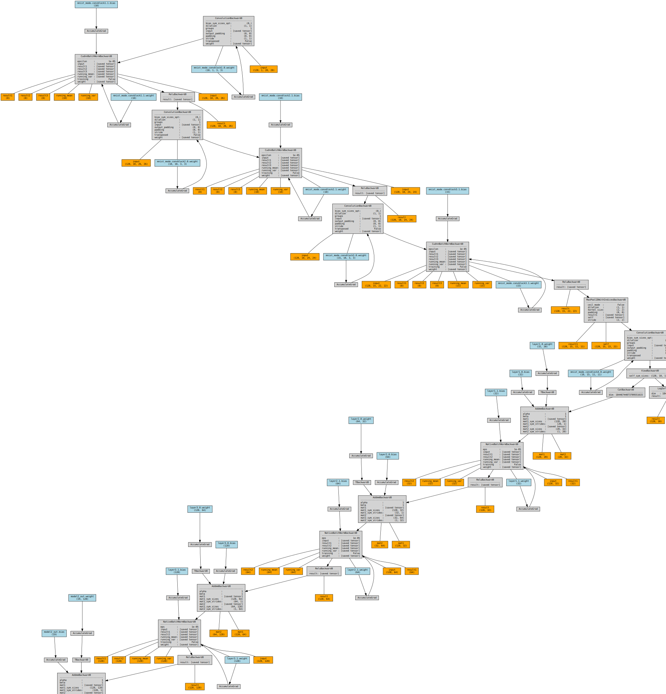
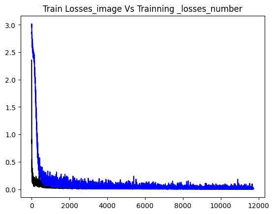
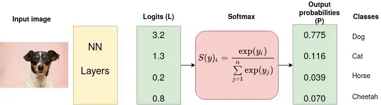
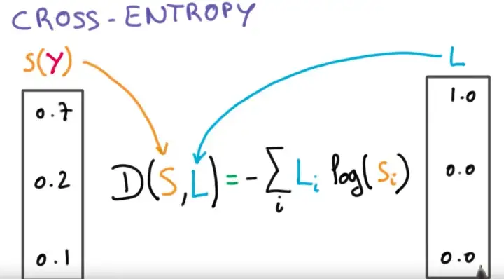
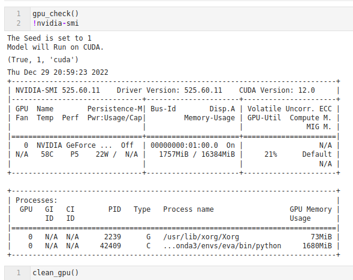

**1>Data representation.**
​ This problem statement need 2 types of data as input. 1> Image 2> A random number. The output of the data is going to be 1> Classifying what is the digit in the image . and the sum of The digit and random number.

For this Problem we are using MNIST data set. MNIST Handwritten Digit Classification Dataset. It is of 60,000 small square 28×28 pixel grayscale images of handwritten single digits between 0 and 9 for training and 10,000 data points for testing.

We are using Numpy to create a 60000 Random Numbers to generate between 0 to 9 . And using 19 (0.....18) classes to represent the sum .

**2>Data generation strategy**
​ To Create the data we have the Function called data_generator. which helps us returning the Image , Label ,random number , sum value which we can use to create a Data loader.

MNISTRandom_loader Is the data loader which Gives us the required data for the model to Train and Test. We have Done one hot encoding to the random numbers and sum outputs in the loader function.

**3>How you have combined the two inputs ?**
​ Now we have to combine the Two inputs to pass in the model. To do so once we have the data from data loader we train the model 1 i.e MNISt with the image data and return the features of shape [1,10]. Then we have the MNISTadder which needs to be trained for the sum function. for that we have concatenated the Output on model 1 and input using torch.cat([mnist_d,Num],dim = -1) . where mnist_d is of [1,10] shape and Num is [1,10] shape . Output of the concatenation is [1,20] shape .

To understand Better let's Visualise the Graph.
<p>

<p>


Blue boxes: these correspond to the tensors we use as parameters, the ones we’re asking PyTorch to compute gradients for;
Gray box: a Python operation that involves a gradient-computing tensor or its dependencies;

Green box: the same as the Gray box, except it is the starting point for the computation of gradients (assuming the **backward() **method is called from the variable used to visualize the graph)— they are computed from the bottom-up in a graph.
----------------------------------------------------------------
```python
----------------------------------------------------------------
        Layer (type)               Output Shape         Param #
================================================================
            Conv2d-1           [-1, 10, 26, 26]              90
       BatchNorm2d-2           [-1, 10, 26, 26]              20
              ReLU-3           [-1, 10, 26, 26]               0
           Dropout-4           [-1, 10, 26, 26]               0
            Conv2d-5           [-1, 10, 24, 24]             900
       BatchNorm2d-6           [-1, 10, 24, 24]              20
              ReLU-7           [-1, 10, 24, 24]               0
           Dropout-8           [-1, 10, 24, 24]               0
            Conv2d-9           [-1, 15, 22, 22]           1,350
      BatchNorm2d-10           [-1, 15, 22, 22]              30
             ReLU-11           [-1, 15, 22, 22]               0
        MaxPool2d-12           [-1, 15, 11, 11]               0
           Conv2d-13             [-1, 10, 1, 1]          18,150
            MNISt-14       [[-1, 10], [-1, 10]]               0
           Linear-15                   [-1, 32]             672
      BatchNorm1d-16                   [-1, 32]              64
             ReLU-17                   [-1, 32]               0
          Dropout-18                   [-1, 32]               0
           Linear-19                   [-1, 64]           2,112
      BatchNorm1d-20                   [-1, 64]             128
             ReLU-21                   [-1, 64]               0
          Dropout-22                   [-1, 64]               0
           Linear-23                  [-1, 128]           8,320
      BatchNorm1d-24                  [-1, 128]             256
             ReLU-25                  [-1, 128]               0
          Dropout-26                  [-1, 128]               0
           Linear-27                   [-1, 19]           2,451
```

**4> What results you finally got and how did you evaluate your results ?**


Above is the Loss graph for the model. The Loss is the combination of Loss 1 And Loss 2. where Loss one is F.nll_loss(y_pred1, target1) and Loss 2 is nn.CrossEntropyLoss(). To do this calculation of loss we have created a function total_loss.




Training model Epochs

epochs : 25

Batch size = 128

Lr : 0.01 (Not used any tool for finding correct lr yet)

optimizer: SGD

Accuracy1,Loss1 = MNIST model accuracy and loss

Accuracy 2,loss2 = Sum model accuracy and loss

```python
EPOCH: 15
Train ==>Batch:468,Total-loss=0.02627,Acc1=99.77%,Acc2=99.41: 100%|███| 469/469 [00:02<00:00, 173.01it/s]
Test ==> batch:78, Average loss: 0.0005 Accuracy1: 99.07 % ,Accuracy2:98.96%: 100%|█| 79/79 [00:00<00:00,
============================================================
EPOCH: 16
Train ==>Batch:468,Total-loss=0.08591,Acc1=99.78%,Acc2=99.33: 100%|███| 469/469 [00:02<00:00, 169.94it/s]
Test ==> batch:78, Average loss: 0.0006 Accuracy1: 98.96 % ,Accuracy2:98.90%: 100%|█| 79/79 [00:00<00:00,
============================================================
EPOCH: 17
Train ==>Batch:468,Total-loss=0.02866,Acc1=99.77%,Acc2=99.37: 100%|███| 469/469 [00:02<00:00, 170.68it/s]
Test ==> batch:78, Average loss: 0.0006 Accuracy1: 98.94 % ,Accuracy2:98.93%: 100%|█| 79/79 [00:00<00:00,
============================================================
EPOCH: 18
Train ==>Batch:468,Total-loss=0.03508,Acc1=99.83%,Acc2=99.44: 100%|███| 469/469 [00:02<00:00, 170.79it/s]
Test ==> batch:78, Average loss: 0.0006 Accuracy1: 98.98 % ,Accuracy2:98.86%: 100%|█| 79/79 [00:00<00:00,
============================================================
EPOCH: 19
Train ==>Batch:468,Total-loss=0.02694,Acc1=99.83%,Acc2=99.51: 100%|███| 469/469 [00:02<00:00, 169.81it/s]
Test ==> batch:78, Average loss: 0.0005 Accuracy1: 98.99 % ,Accuracy2:98.97%: 100%|█| 79/79 [00:00<00:00,
============================================================
EPOCH: 20
Train ==>Batch:468,Total-loss=0.01643,Acc1=99.81%,Acc2=99.44: 100%|███| 469/469 [00:02<00:00, 170.10it/s]
Test ==> batch:78, Average loss: 0.0006 Accuracy1: 98.87 % ,Accuracy2:98.67%: 100%|█| 79/79 [00:00<00:00,
============================================================
EPOCH: 21
Train ==>Batch:468,Total-loss=0.07103,Acc1=99.80%,Acc2=99.45: 100%|███| 469/469 [00:02<00:00, 172.06it/s]
Test ==> batch:78, Average loss: 0.0006 Accuracy1: 99.00 % ,Accuracy2:98.85%: 100%|█| 79/79 [00:00<00:00,
============================================================
EPOCH: 22
Train ==>Batch:468,Total-loss=0.01096,Acc1=99.85%,Acc2=99.57: 100%|███| 469/469 [00:02<00:00, 171.73it/s]
Test ==> batch:78, Average loss: 0.0005 Accuracy1: 99.11 % ,Accuracy2:99.04%: 100%|█| 79/79 [00:00<00:00,
============================================================
EPOCH: 23
Train ==>Batch:468,Total-loss=0.12791,Acc1=99.88%,Acc2=99.56: 100%|███| 469/469 [00:02<00:00, 170.45it/s]
Test ==> batch:78, Average loss: 0.0006 Accuracy1: 98.98 % ,Accuracy2:98.84%: 100%|█| 79/79 [00:00<00:00,
============================================================
EPOCH: 24
Train ==>Batch:468,Total-loss=0.02316,Acc1=99.88%,Acc2=99.63: 100%|███| 469/469 [00:02<00:00, 171.84it/s]
Test ==> batch:78, Average loss: 0.0005 Accuracy1: 99.10 % ,Accuracy2:98.97%: 100%|█| 79/79 [00:00<00:00,
```

y_pred1,y_pred2 = model(data1,data2)  # Getting the Model output for a batch 
loss1,loss2 = total_loss(y_pred1, target1,y_pred2, target2.argmax(dim = 1)) #Calculating total loss from a custom function 
test_losses1 += loss1.item() # sum up batch loss1 MNIST
test_losses2 += loss2.item() # sum up batch loss2 Adder
pred = y_pred1.argmax(dim=1, keepdim=True)  # get the index of the max log-probability
correct += pred.eq(target1.view_as(pred)).sum().item() #Chceking the correct class for Image 
second_correct += y_pred2.argmax(dim =1).eq(target2.argmax(dim = 1)).sum().item() #Chceking the correct class for Summ function 

**5>What loss function you picked and why ?**
For The **MNISt (CNN) model ** We are using the Loss function as The negative log likelihood loss.
The negative log-likelihood is bad at smaller values, where it can reach infinite (that's too sad), and becomes good at larger values. Because we are summing the loss function to all the correct classes, what's actually happening is that whenever the network assigns high confidence at the correct class, the unhappiness is low, and vice-versa. The input given through a forward call is expected to contain log-probabilities of each class. Means it needs a LogSoftmax layer before this .

Formula: 


For the Numeric model I tried CrossEntropyLoss.
because from the PyTorch Documentation I learned that Obtaining log-probabilities in a neural network is easily achieved by adding a LogSoftmax layer in the last layer of your network. We may use CrossEntropyLoss instead, if you prefer not to add an extra layer.

As we don't have a LogSoftmax layer in MNISTadder (Summing ) model .



Formula: $$ loss(x,class)=−log( ∑ j​exp(x[j]) exp(x[class])​)=−x[class]+log( j ∑​exp(x[j])) $$

referace: https://medium.com/unpackai/cross-entropy-loss-in-ml-d9f22fc11fe0#:~:text=Cross%2Dentropy%20can%20be%20calculated,*%20log(Q(x))


**6>MUST happen on the GPU**
Created A GPU checker function To return the GPU information.




# Checking the TRUTH :-)
next(model2.parameters()).is_cuda
True
